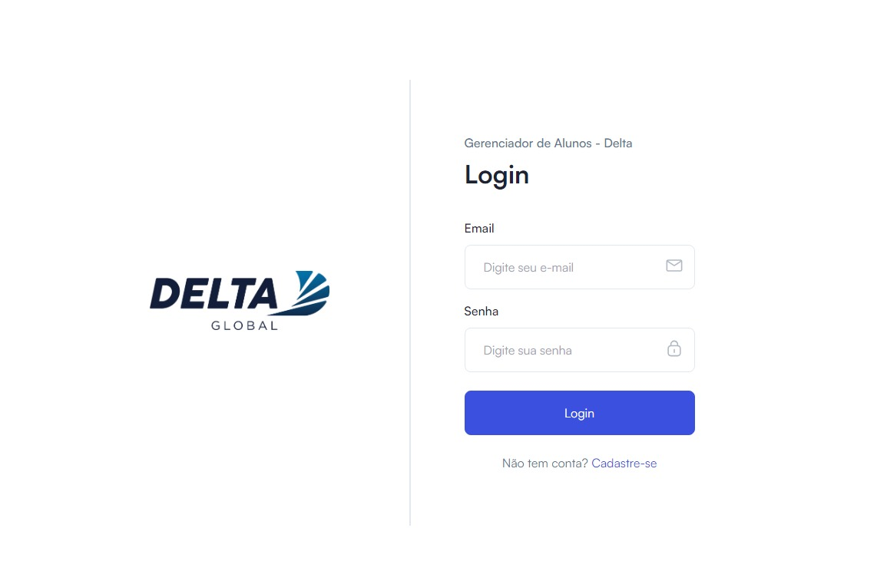
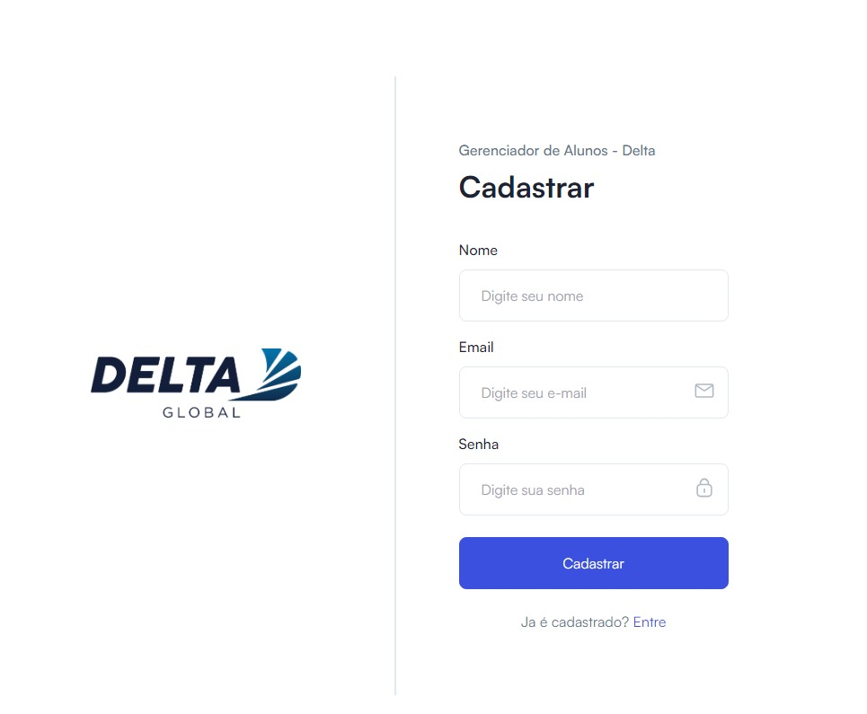
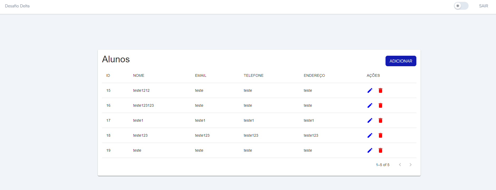
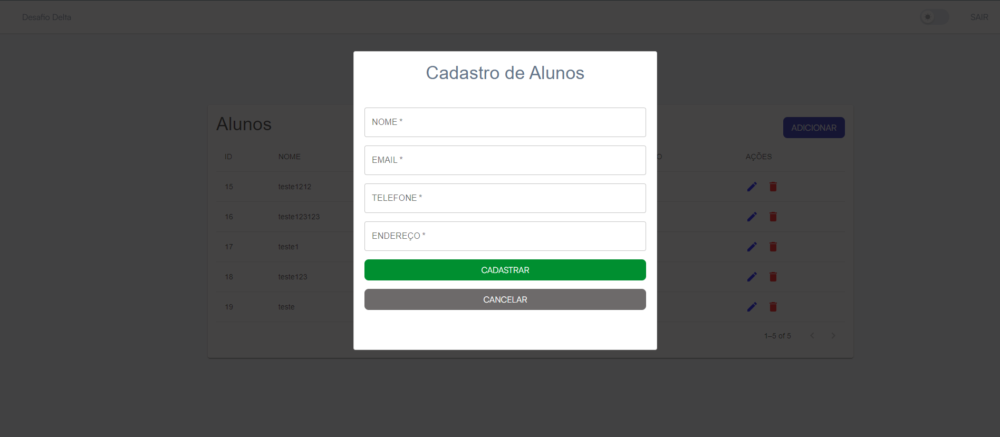

# FrontEnd Desafio - Delta Global

Front-End para o desafio fullstack da Delta Global


### 📋 Pré-requisitos

```
Node - 18.0.0 ou superior
```

### 🔧 Instalação

ao entrar na pasta do projeto pelo terminal executar:

```
- npm install
- npm run dev
```

## Tela de Login



## Tela de Registro




## Listagem de Alunos




## Criar alunos


